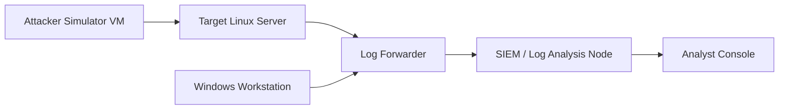

# SOC Home Lab

## Overview
A documentation-first SOC learning lab with safe simulated incidents and detection planning.

## Objectives
- Design a small SOC-style lab topology.
- Define log sources and triage workflows.
- Practice incident investigation and remediation steps.

## Features
- Mermaid topology diagram.
- Setup guidance and log source inventory.
- Detection scenarios and pseudo-rules.
- Investigation and remediation checklists.

## Technologies
- Linux
- Windows event logs (simulated)
- SIEM concepts
- Markdown and Mermaid

## Setup
Follow the setup section and keep all systems in an isolated virtual lab network.

## Usage
Use the detection scenarios during tabletop or lab simulation sessions.

## Example Output
```text
Alert: repeated failed SSH logins from 192.168.56.10 exceeded threshold.
```

## Security Considerations
Scenarios are simulated and authorized lab-only.

## Status
- **Current Status:** In Progress

## Evidence to Add
- [ ] Updated topology screenshot or diagram revision from your lab.
- [ ] Sanitized alert triage notes for one simulated incident.
- [ ] Rule-tuning note with reason for threshold changes.

## Lessons Learned
Good telemetry and checklists speed consistent response.

## Future Improvements
Add mapped ATT&CK techniques for each scenario.

## Lab Topology (Mermaid)


## Setup Guide
1. Create isolated virtual network.
2. Deploy Linux target and Windows workstation.
3. Enable SSH auth logs and Windows security logs.
4. Forward logs to a central analysis node.

## Log Sources
- Linux `auth.log`
- Linux firewall logs
- Windows Security event logs
- DNS and network flow summaries

## Detection Scenarios
- Repeated failed logins (SSH/RDP) in isolated lab.
- Controlled port scanning from simulator VM.
- Suspicious PowerShell command execution (simulated).
- New local account creation.
- Unusual outbound traffic to unknown destination.

## Generic Rule Pseudocode
```yaml
title: Repeated SSH Failures
logsource:
  product: linux
  service: auth
condition: count(failed_login where src_ip same over 5m) >= 5
level: medium
```

## Incident Investigation Checklist
- Confirm alert source and timestamp.
- Validate event context from multiple logs.
- Identify affected host/user accounts.
- Scope related activity in same period.
- Document evidence and actions taken.

## Remediation Checklist
- Block or isolate malicious source in lab firewall.
- Reset impacted credentials in simulation.
- Apply hardening updates and verify configuration.
- Tune detection rule thresholds if needed.
